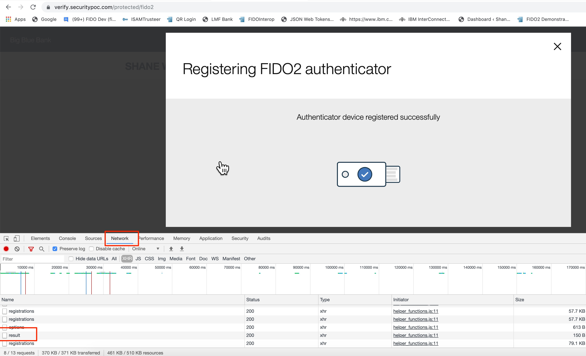
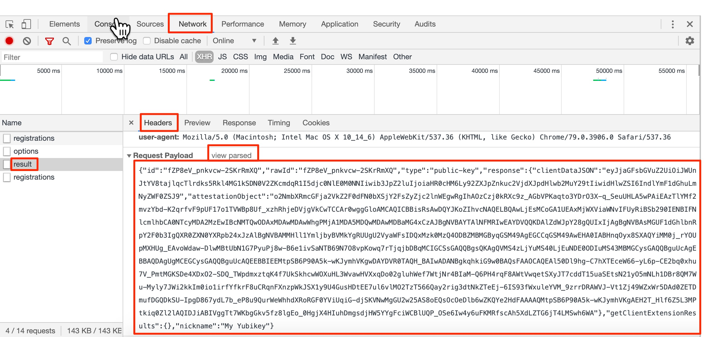
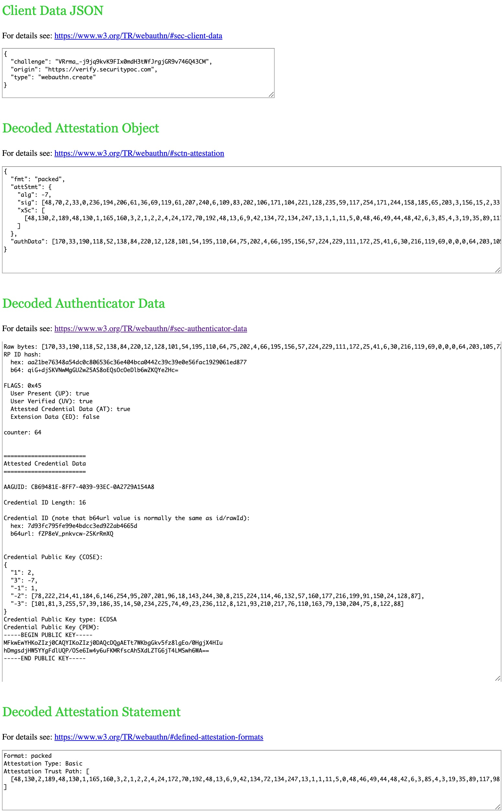
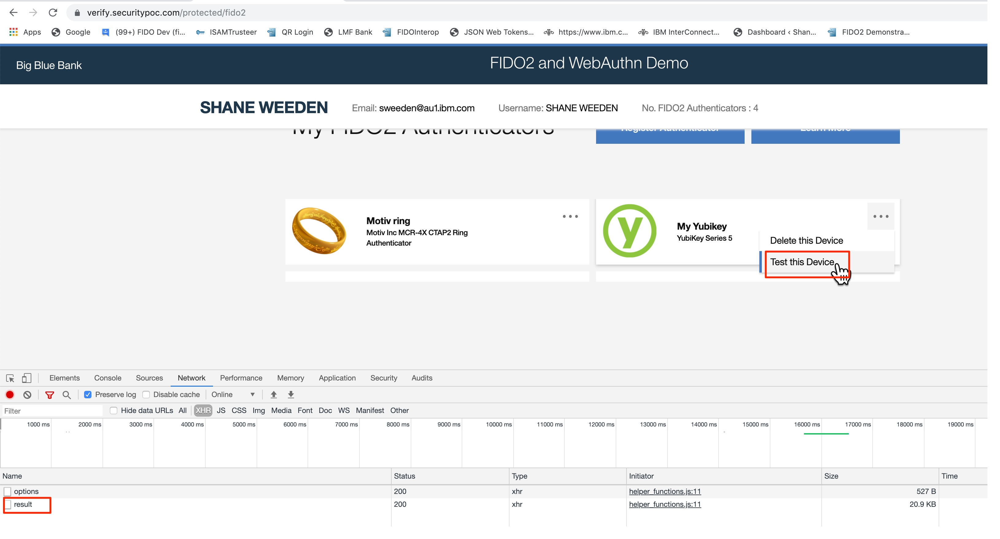
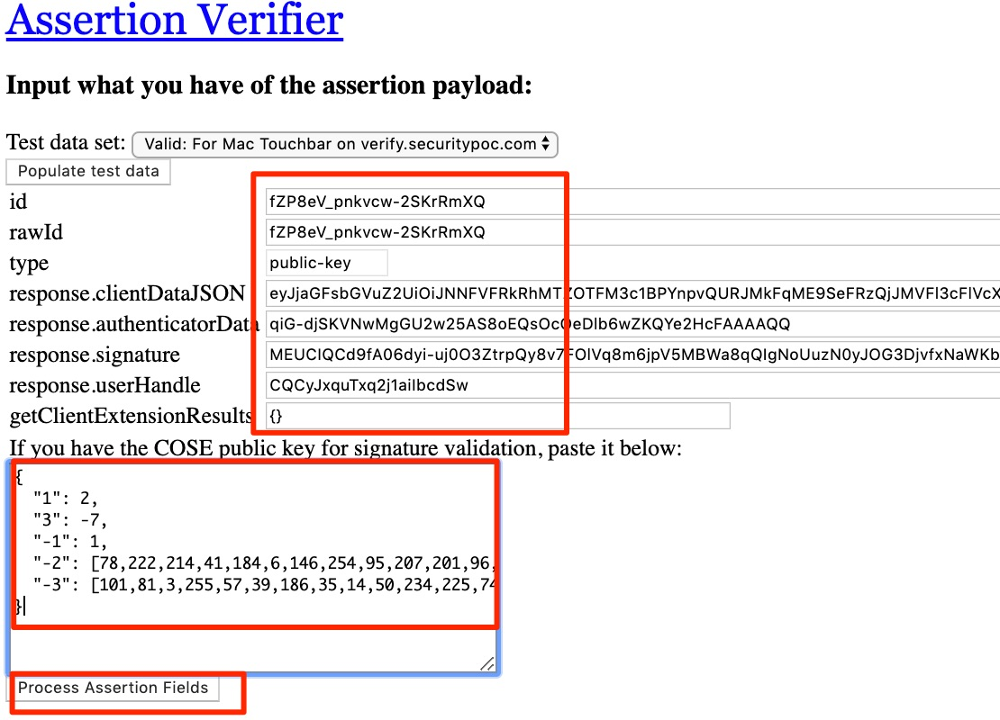
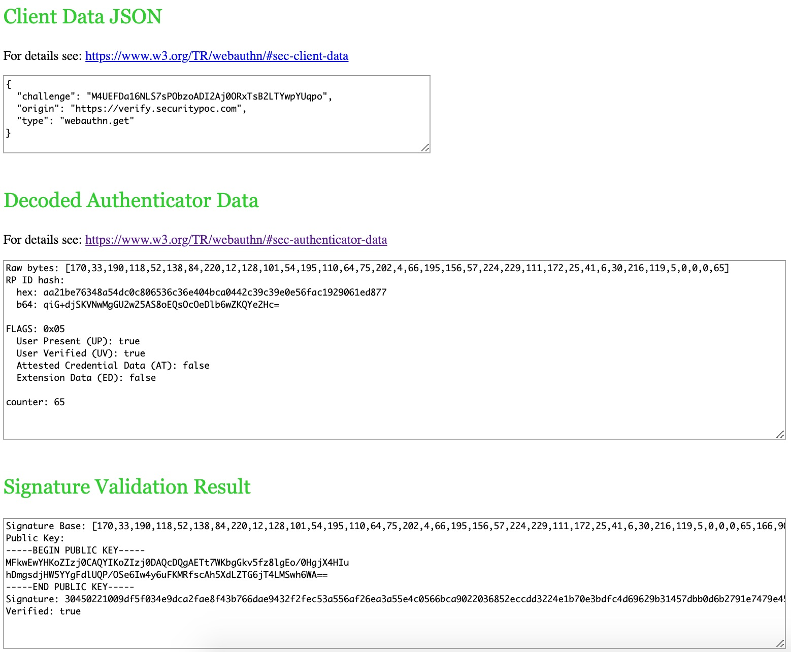

# fido2viewer

This is a free, simple, standalone-in-the-browser viewer for FIDO2 attestation and assertion payload inspection.

It covers the inspection of a variety of common attestation formats and is useful for debugging and informal educational purposes when learning about FIDO2 messages.

Clone the repository, then just open the fido2viewer.html in your browser, such as:

file:///your/path/to/fido2viewer/fido2viewer.html

Click on one of the large headings to expand viewer entry fields for attestation or assertion payloads.

Here is an example of use...

Using a Chrome browser, with network inspector open, I captured a registration results payload of a FIDO2 registration with a Yubikey to the IBM demonstration site for FIDO2, https://verify.securitypoc.com, as shown:



Note that while this payload was captured from the IBM demonstration site, most FIDO2 server sites use the same type of payload encoding and field names - based on the non-normative FIDO2 server specification found here: https://fidoalliance.org/specs/fido-v2.0-rd-20180702/fido-server-v2.0-rd-20180702.html


Take the JSON of the message payload:



Tidying up the formatting allows us to see the payload fields more easily:

```
{
  "id": "fZP8eV_pnkvcw-2SKrRmXQ",
  "rawId": "fZP8eV_pnkvcw-2SKrRmXQ",
  "type": "public-key",
  "response": {
    "clientDataJSON": "eyJjaGFsbGVuZ2UiOiJWUnJtYV8tajlqcTlrdks5Rkl4MG1kSDN0V2ZKcmdqR1I5djc0NlE0M0NNIiwib3JpZ2luIjoiaHR0cHM6Ly92ZXJpZnkuc2VjdXJpdHlwb2MuY29tIiwidHlwZSI6IndlYmF1dGhuLmNyZWF0ZSJ9",
    "attestationObject": "o2NmbXRmcGFja2VkZ2F0dFN0bXSjY2FsZyZjc2lnWEgwRgIhAOzCzj0kRXc9z_AGbVPKaqto3YDrO3X-q_SeuUHLA5wPAiEAzTlYMf2mvzYbd-K2qrfvF9pUF17o1TVWBp8Uf_xzhRhjeDVjgVkCwTCCAr0wggGloAMCAQICBBisRsAwDQYJKoZIhvcNAQELBQAwLjEsMCoGA1UEAxMjWXViaWNvIFUyRiBSb290IENBIFNlcmlhbCA0NTcyMDA2MzEwIBcNMTQwODAxMDAwMDAwWhgPMjA1MDA5MDQwMDAwMDBaMG4xCzAJBgNVBAYTAlNFMRIwEAYDVQQKDAlZdWJpY28gQUIxIjAgBgNVBAsMGUF1dGhlbnRpY2F0b3IgQXR0ZXN0YXRpb24xJzAlBgNVBAMMHll1YmljbyBVMkYgRUUgU2VyaWFsIDQxMzk0MzQ4ODBZMBMGByqGSM49AgEGCCqGSM49AwEHA0IABHnqOyx8SXAQYiMM0j_rYOUpMXHUg_EAvoWdaw-DlwMBtUbN1G7PyuPj8w-B6e1ivSaNTB69N7O8vpKowq7rTjqjbDBqMCIGCSsGAQQBgsQKAgQVMS4zLjYuMS40LjEuNDE0ODIuMS43MBMGCysGAQQBguUcAgEBBAQDAgUgMCEGCysGAQQBguUcAQEEBBIEEMtpSB6P90A5k-wKJymhVKgwDAYDVR0TAQH_BAIwADANBgkqhkiG9w0BAQsFAAOCAQEAl50Dl9hg-C7hXTEceW66-yL6p-CE2bq0xhu7V_PmtMGKSDe4XDxO2-SDQ_TWpdmxztqK4f7UkSkhcwWOXuHL3WvawHVXxqDo02gluhWef7WtjNr4BIaM-Q6PH4rqF8AWtVwqetSXyJT7cddT15uaSEtsN21yO5mNLh1DBr8QM7Wu-Myly7JWi2kkIm0io1irfYfkrF8uCRqnFXnzpWkJSX1y9U4GusHDtEE7ul6vlMO2TzT566Qay2rig3dtNkZTeEj-6IS93fWxuleYVM_9zrrDRAWVJ-Vt1Zj49WZxWr5DAd0ZETDmufDGQDkSU-IpgD867ydL7b_eP8u9QurWeWhhdXRoRGF0YViUqiG-djSKVNwMgGU2w25AS8oEQsOcOeDlb6wZKQYe2HdFAAAAQMtpSB6P90A5k-wKJymhVKgAEH2T_Hlf6Z5L3MPtkiq0Zl2lAQIDJiABIVggTt7WKbgGkv5fz8lgEo_0HgjX4HIuhDmgsdjHW5YYgFciWCBlUQP_OSe6Iw4y6uFKMRfscAh5XdLZTG6jT4LMSwh6WA"
  },
  "getClientExtensionResults": {},
  "nickname": "My Yubikey"
}
```


Fields from the result payload can be pasted directly into the attestation viewer as shown:


Then just press the Process Attestation Fields button, and the details section of the page will be filled with a breakdown of the parsed information:




To follow up with how the Assertion Verifier works, at this point take note of the COSE Key that the Attestation Viewer displayed, as we will use this later. From my capture, the COSE Key is found in the Decoded Authenticator Data section:

```
{
  "1": 2,
  "3": -7,
  "-1": 1,
  "-2": [78,222,214,41,184,6,146,254,95,207,201,96,18,143,244,30,8,215,224,114,46,132,57,160,177,216,199,91,150,24,128,87],
  "-3": [101,81,3,255,57,39,186,35,14,50,234,225,74,49,23,236,112,8,121,93,210,217,76,110,163,79,130,204,75,8,122,88]
}
```


Now performing an assertion operation on the IBM demonstration site using this authenticator, I captured assertion results (you can do this with the Test Device feature shown) in the network inspector of the browser:



Extracted from the browser network inspector and formatted, the assertion results payload looks like:

```
{
  "id": "fZP8eV_pnkvcw-2SKrRmXQ",
  "rawId": "fZP8eV_pnkvcw-2SKrRmXQ",
  "type": "public-key",
  "response": {
    "clientDataJSON": "eyJjaGFsbGVuZ2UiOiJNNFVFRkRhMTZOTFM3c1BPYnpvQURJMkFqME9SeFRzQjJMVFl3cFlVcXBvIiwib3JpZ2luIjoiaHR0cHM6Ly92ZXJpZnkuc2VjdXJpdHlwb2MuY29tIiwidHlwZSI6IndlYmF1dGhuLmdldCJ9",
    "authenticatorData": "qiG-djSKVNwMgGU2w25AS8oEQsOcOeDlb6wZKQYe2HcFAAAAQQ",
    "signature": "MEUCIQCd9fA06dyi-uj0O3ZtrpQy8v7FOlVq8m6jpV5MBWa8qQIgNoUuzN0yJOG3DjvfxNaWKbMUV9uw1rJ5HnR55FRSpXQ",
    "userHandle": "CQCyJxquTxq2j1aiIbcdSw"
  },
  "getClientExtensionResults": {}
}
```


The fields from this assertion results payload, along with the COSE Key from the previous attestation can be provide to the Assertion Verifier:




Click on Process Assertion Fields and you should see a detailed breakdown of the fields, and even the results of a signature validation check using the registered public key (COSE Key):



Some other things to note:

* There are a couple of sample test datasets built into the tool that you can populate the verifiers with if you don't have your own - just to see how it works. I have used the data shown in this README as one of the test datasets.
* If you don't have all the fields available for one of the verifiers (say you only want to inspect the attestationObject but don't have the clientDataJSON), the tool will still work, and show you the unpacked data for as many of the fields as you can provide.
* This tool makes use of several other open source libraries, and those libraries and their licenses are embedded in this repository so the tool works standalone when you clone the repository without cross-origin read blocking issues. The HTML head section of fido2viewer.html lists all of the open source libraries that were used, and the location that the files originally came from. I'd like to acknowledge and thank the authors of those libraries, as without them building this FIDO2 viewer would have been much more work.


